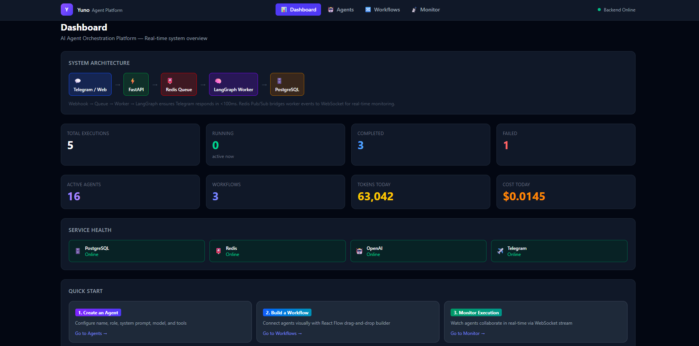
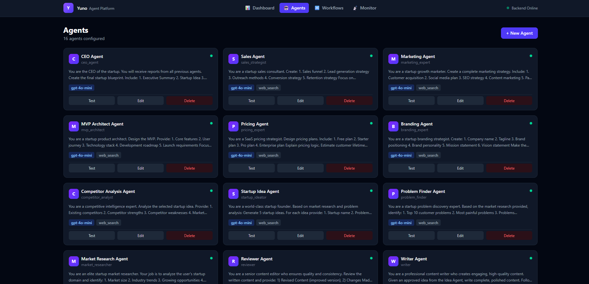
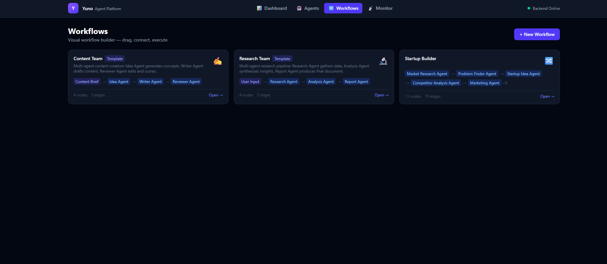
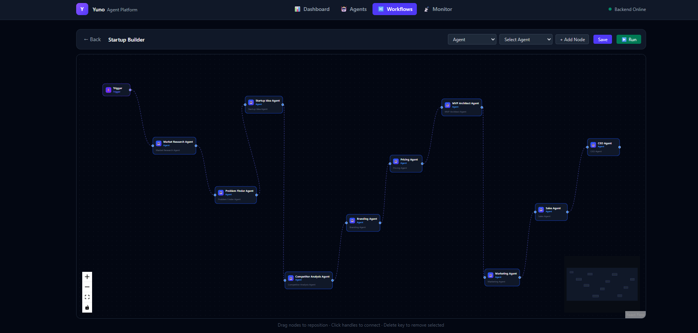
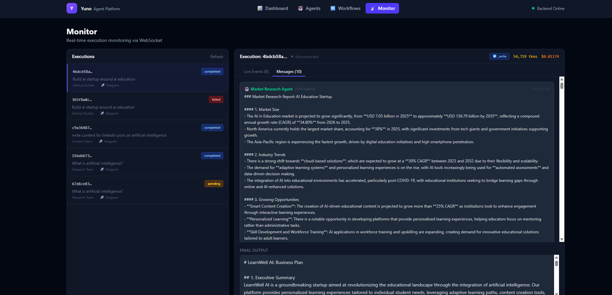
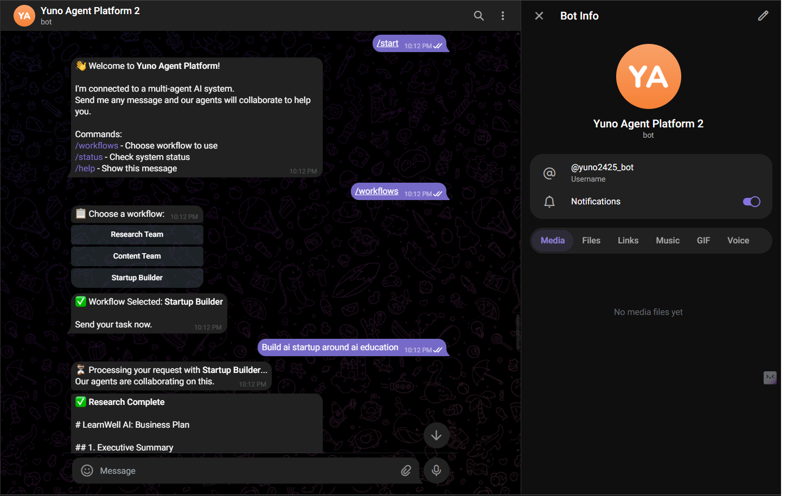

# 🚀 Yuno Agent Platform

> Build, orchestrate, and deploy AI Teams instead of single AI assistants.


Yuno Agent Platform is a visual multi-agent orchestration system that allows users to create specialized AI agents, connect them into workflows, and execute complex tasks through collaborative AI teams.

Unlike traditional chatbots that rely on a single model, Yuno enables multiple specialized agents to work together as a complete AI department.

---

## 🌐 Live Demo

### Frontend (Vercel)

🔗 https://ai-agent-platform-gv2r.vercel.app/

### Backend (Render)

🔗 https://ai-agent-platform-zh4d.onrender.com

### Telegram Bot

🔗 https://t.me/Yuno2425_bot

---

# 🎯 What is Yuno Agent Platform?

Most AI tools work like this:

```text
User
 ↓
AI Tool(Chatgpt)
 ↓
Answer
```

Yuno works like this:

```text
User
 ↓
Research Agent
 ↓
Analysis Agent
 ↓
Marketing Agent
 ↓
Sales Agent
 ↓
CEO Agent
 ↓
Final Business Report
```

Instead of one AI assistant, users get an entire AI organization.

---

# ✨ Features

## 🤖 AI Agent Builder

Create specialized AI agents with:

- Custom System Prompts
- Tool Access
- Model Selection
- Independent Testing
- Role Specialization

Examples:

- Research Agent
- Marketing Agent
- Sales Agent
- Coding Agent
- Startup Advisor
- Financial Analyst

---

## 🔄 Visual Workflow Builder

Create AI pipelines visually using drag-and-drop.

```text
User Input
     ↓
Research Agent
     ↓
Analysis Agent
     ↓
Report Agent
```

No coding required.

---

## 🧠 Multi-Agent Collaboration

Agents can collaborate together.

Example:

```text
Market Research Agent
          ↓
Problem Finder Agent
          ↓
Startup Idea Agent
          ↓
Competitor Analysis Agent
          ↓
Branding Agent
          ↓
Pricing Agent
          ↓
Marketing Agent
          ↓
Sales Agent
          ↓
CEO Agent
```

One user prompt can trigger an entire AI business team.

---

## 📱 Telegram Integration

Execute workflows directly from Telegram.

Features:

- Workflow Execution
- Real-time Responses
- Background Processing
- Multi-Agent Collaboration
- Notifications

---

## 📊 Real-Time Monitoring

Monitor workflow execution live.

Track:

- Agent Execution
- Token Consumption
- Workflow Progress
- Event Streams
- Execution Logs

---

## 🧩 Workflow Templates

### Research Team

```text
Research Agent
      ↓
Analysis Agent
      ↓
Report Agent
```

### Content Team

```text
Idea Agent
      ↓
Writer Agent
      ↓
Reviewer Agent
```

### Startup Builder

```text
Market Research Agent
      ↓
Problem Finder Agent
      ↓
Startup Idea Agent
      ↓
Competitor Analysis Agent
      ↓
Branding Agent
      ↓
Pricing Agent
      ↓
MVP Architect Agent
      ↓
Marketing Agent
      ↓
Sales Agent
      ↓
CEO Agent
```

---

# 🏗️ Architecture

```text
                    ┌──────────────┐
                    │   Frontend   │
                    │ React + Vite │
                    └──────┬───────┘
                           │
                           ▼
                 ┌─────────────────┐
                 │ FastAPI Backend │
                 └──────┬──────────┘
                        │
        ┌───────────────┼───────────────┐
        ▼               ▼               ▼

   PostgreSQL       Redis         LangGraph

        ▼               ▼               ▼

      Agents ───► Workflows ───► Execution Engine

                        ▼

                  Telegram Bot
```

---

# ⚙️ Tech Stack

## Frontend

- React
- TypeScript
- Vite
- Tailwind CSS
- React Flow

## Backend

- FastAPI
- LangGraph
- LangChain
- OpenAI
- Redis
- PostgreSQL

## Infrastructure

- Vercel
- Render
- PostgreSQL
- Redis

## Integrations

- Telegram Bot API
- OpenAI API

---

# 📸 Screenshots

## Dashboard



---

## Agent Builder



---

## Workflow Builder




---

## Execution Monitor



---

## Telegram Integration



---

# 🚀 Installation

## Clone Repository

```bash
git clone https://github.com/YOUR_USERNAME/yuno-agent-platform.git

cd yuno-agent-platform
```

---

## Frontend Setup

```bash
cd frontend

npm install

npm run dev
```

---

## Backend Setup

```bash
cd backend

pip install -r requirements.txt

uvicorn app.main:app --reload
```

---

# 🔐 Environment Variables

## Backend

Create `.env`

```env
OPENAI_API_KEY=

DATABASE_URL=

REDIS_URL=

TELEGRAM_BOT_TOKEN=

TELEGRAM_WEBHOOK_SECRET=
```

## Frontend

```env
VITE_API_URL=
```

---

# 📈 Example Use Cases

## Startup Generator

Input:

```text
Build an AI startup for education.
```

Output:

- Market Opportunity
- Problem Validation
- Startup Idea
- Competitor Analysis
- Branding
- Pricing Strategy
- MVP Plan
- Marketing Strategy
- Sales Plan
- CEO Summary

---

## Research Assistant

Input:

```text
Artificial Intelligence in Healthcare
```

Output:

- Research
- Analysis
- Insights
- Executive Summary

---

## Content Factory

Input:

```text
Create LinkedIn content for AI founders
```

Output:

- Ideas
- Drafts
- Review
- Final Content

---

# 🎯 Future Roadmap

- [ ] Workflow Marketplace
- [ ] Agent Memory
- [ ] Voice Agents
- [ ] Autonomous Agents
- [ ] Multi-Model Support
- [ ] Slack Integration
- [ ] WhatsApp Integration
- [ ] Human Approval Workflows
- [ ] Enterprise Workspaces

---

# 🤝 Contributing

Contributions are welcome.

```bash
Fork Repository

Create Feature Branch

Commit Changes

Push Branch

Open Pull Request
```

---

# ⭐ Support

If you find this project useful, please give it a star ⭐

It helps the project grow and motivates future development.

---

# 👨‍💻 Author

### Himanshu Kumar Bhagat

GitHub: https://github.com/himanshu25122002

LinkedIn: https://www.linkedin.com/in/himanshu-kumar-bhagat/

---
